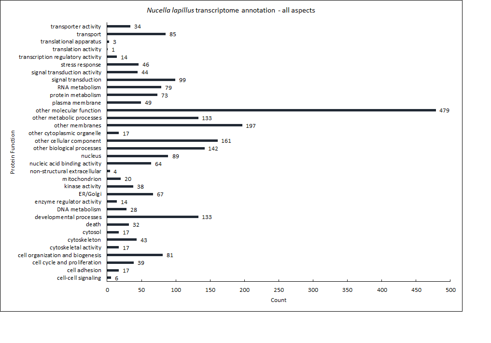
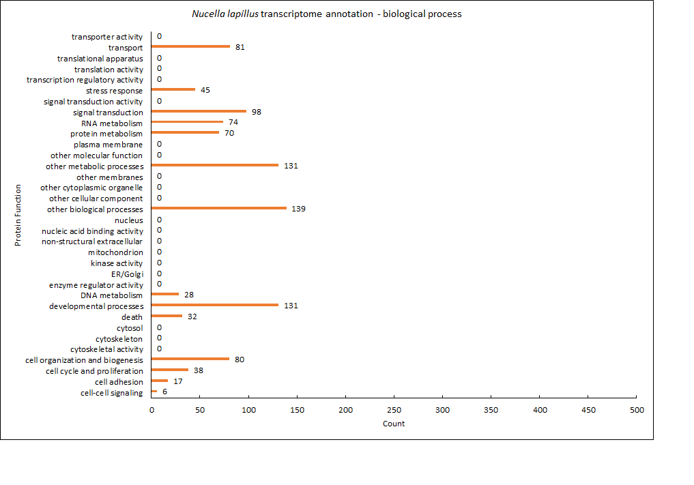
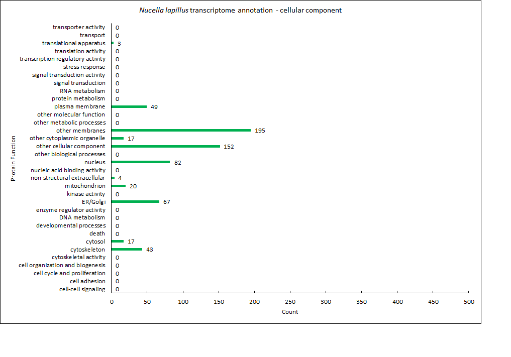
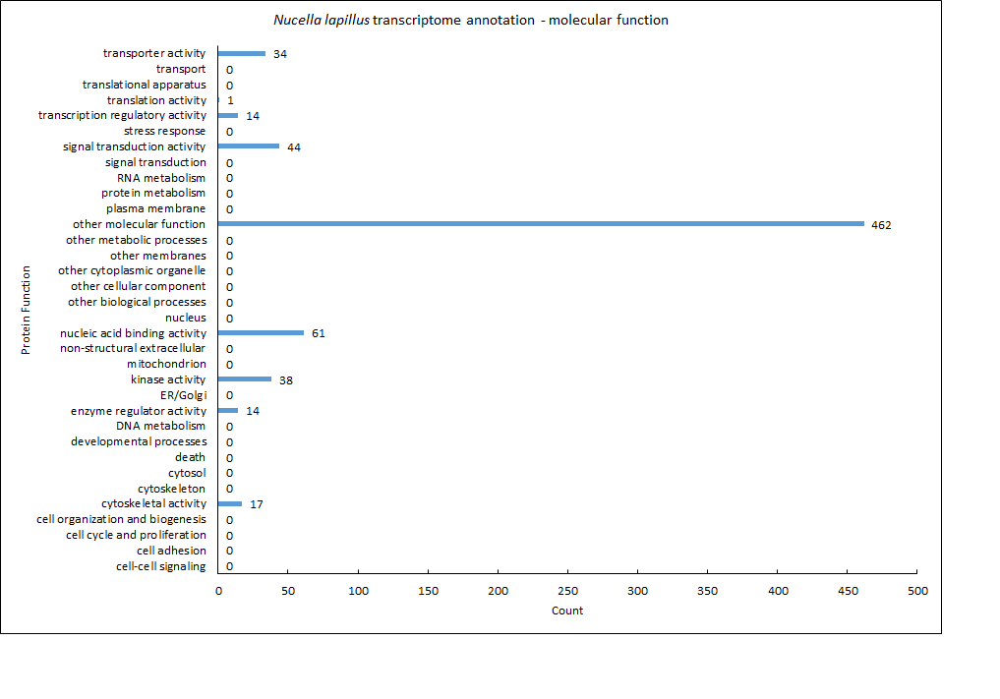
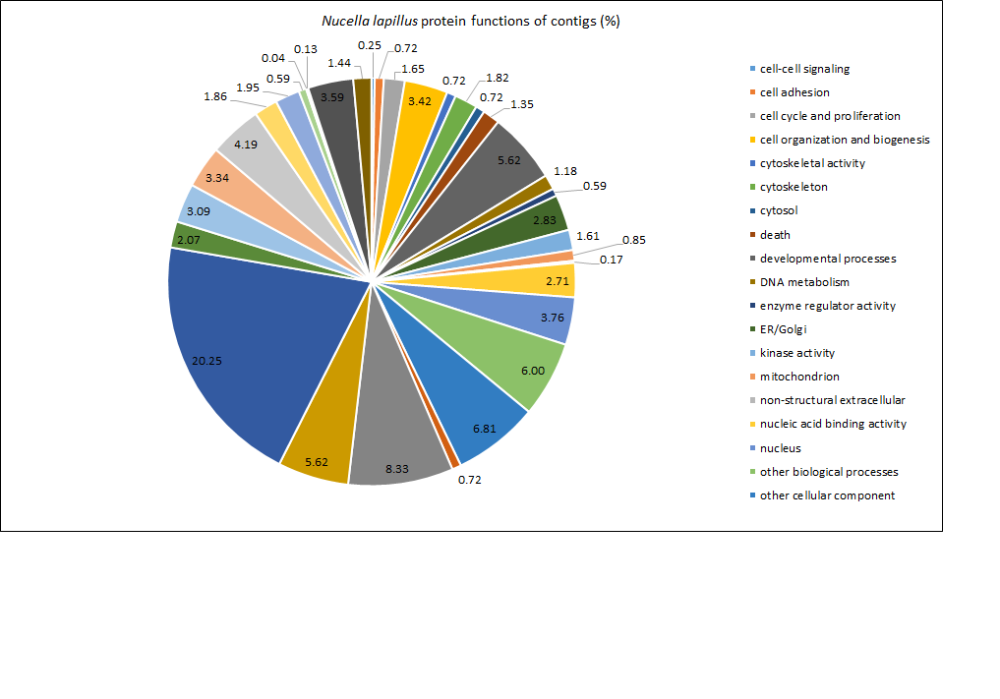

# Workflow

By following the steps in this workflow, you should be able to produce transcriptome annotation files for the dogwhelk, *Nucella lapillus* with Gene Ontology information and protein names information. You should also be able to produce stress subsets of the annotations. This workflow includes the steps for visualizing the annotations. A list of products produced in this workflow is available at the end of this document.

Software/tools used in this workflow:

- Windows 7 PC
- Roberts Lab Hummingbird (Mac OS v10.9.5)
- Bash (I used [Git Bash](https://msysgit.github.io/))
- Blast 2.2.29 (current version available on [NCBI](ftp://ftp.ncbi.nlm.nih.gov/blast/executables/blast+/LATEST/))
- SQLShare (in browswer, [link](https://sqlshare.escience.washington.edu/accounts/login/?next=/sqlshare/%3F__hash__%3D%2523s%253Dhome#s=home))
- Microsoft Excel 2013 for Windows
- GitHub GUI for windows ([link](https://windows.github.com/))

This workflow is split into three sections:

1. Blast
2. Gene Ontology and Protein Name Information
3. Visualization 

# 1) Blast

### Obtain *N. lapillus* transcriptome
Download *N. lapillus* transcriptome (`.fa`, 50,698 KB) from Dryad Digital Repository ([doi link](http://datadryad.org/resource/doi:10.5061/dryad.610dd/4)) published in [Chu et al. (2014)](http://dx.doi.org/10.1111/mec.12681). Name the file `N.lapillus.fa`.

File here: [`N.lapillus.fa`](./data/N_lapillus.fa)

### Obtain Uniprot dataset
Download zipped Uniprot-SwissProt dataset (`.fasta.gz`, 260,395 KB) from [Uniprot website](http://www.uniprot.org/downloads).

	hummingbird:willbigdata srlab$ curl -o uniprot_sprot.fasta.gz \
	ftp://ftp.uniprot.org/pub/databases/uniprot/current_release/knowledgebase/complete/uniprot_sprot.fasta.gz

Unzip the file
	
	hummingbird:willbigdata srlab$ gzip -d uniprot_sprot.fasta.gz
	hummingbird:willbigdata srlab$ ls
	uniprot_sprot.fasta

### Specify Blast database

Set Uniprot dataset as the database for `blastx`

	hummingbird:willbigdata srlab$ makeblastdb \
	-in uniprot_sprot.fasta \
	-dbtype \
	-out uniprot_sprot_21JAN2015
	Building a new DB, current time: 01/21/2015 20:48:51
	New DB name:   uniprot_sprot_21JAN2015
	New DB title:  uniprot_sprot.fasta
	Sequence type: Protein
	Keep Linkouts: T
	Keep MBits: T
	Maximum file size: 1000000000B
	Adding sequences from FASTA; added 547357 sequences in 54.0656 seconds.

This creates the blast database, which appears as three separate files recognized by `blast`.

	uniprot_sprot_21JAN2015.pin
	uniprot_sprot_21JAN2015.phr
	uniprot_sprot_21JAN2015.psq

### Run blastx

	hummingbird:willbigdata srlab$ ls
	uniprot_sprot.fasta             uniprot_sprot_21JAN2015.pin
	uniprot_sprot_21JAN2015.phr     uniprot_sprot_21JAN2015.psq
	hummingbird:willbigdata srlab$ blastx \
	-query /Users/srlab/fish546_W15/nlap-ano/data/N_lapillus.fa \
	-db uniprot_sprot_21JAN2015 \
	-out Nlap_uniprot_blastx.tab \
	-evalue 1E-20 \
	-max_target_seqs 1 \
	-outfmt 6

Notice the Evalue and outputformat as "6" (`.tab`)

Output file here: [`Nlap_uniprot_blastx.tab`](./data/Nlap_uniprot_blastx.tab)

# 2) Gene Ontology and Protein Name Info

Link `blastx` `.tab` output file to GO ids (GOID; [Gene Ontology](http://geneontology.org/)).

Take advantage of Roberts Lab tables on [SQLShare](https://sqlshare.escience.washington.edu/accounts/login/?next=/sqlshare/%3F__hash__%3D%2523s%253Dhome#s=home).

### Isolate SPID

SPID in `blastx` `.tab` output file ([`Nlap_uniprot_blastx.tab`](./data/Nlap_uniprot_blastx.tab)) is among a string of text (e.g. `sp|Q9V8P9|TOPRS_DROME`). Isolate SPID into its own column by changing `|` to tabs (since it's tab delimited) (e.g. `sp	Q9V8P9	TOPRS_DROME`).

	cat Nlap_uniprot_blastx.tab | tr '|' '\t' > Nlap_uniprot_blastx2.tab

Output file here: [`Nlap_uniprot_blastx2.tab`](./data/Nlap_uniprot_blastx2.tab)

### Upload blastx output to SQLShare

	SELECT * FROM [wking2@washington.edu].[table_Nlap_uniprot)blastx2_4.tab]

### Join to GO id's

Join blastx output (`Nlap_uniprot_blastx2_4.tab`) to a [SQL table](https://sqlshare.escience.washington.edu/sqlshare/#s=query/sr320%40washington.edu/SPID%20and%20GO%20Numbers) that has both SPID and GOID. 

The [resulting table](https://sqlshare.escience.washington.edu/sqlshare/#s=query/wking2%40washington.edu/blast_SPID_join) has blastx output data, SPID, and corresponding GOID.

	SELECT *
		FROM [wking2@washington.edu].[Nlap_uniprot_blastx2_4.tab]blast
		Left Join
		[sr320@washington.edu].[SPID and GO Numbers]unp
		on
		blast.Column3 = unp.SPID

### Join to GOSlim terms

Using SQLShare, join [table](https://sqlshare.escience.washington.edu/sqlshare/#s=query/wking2%40washington.edu/blast_SPID_join) from the previous step to a [SQLtable](https://sqlshare.escience.washington.edu/sqlshare/#s=query/sr320%40washington.edu/GO_to_GOslim) that has both GOID and GOSlim terms. 

	SELECT *
		FROM [wking2@washington.edu].[blast_SPID_join]blasp
		Left Join
		[sr320@washington.edu].[Go_to_GOslim]gb
		on
		blasp.GOID=gb.GO_id

The resulting table is an [annotated *Nucella lapillus* transcriptome with contigs and GO info](https://sqlshare.escience.washington.edu/sqlshare/#s=query/wking2%40washington.edu/Nlap_annotated) that has blastx output data, SPID, GOID, and GOSlim terms.

Product 1: Annotated *N. lapillus* transcriptome -- contigs + GO info

File here: [`Nlap_annotated_GO.csv`](./products/Nlap_annotated_GO.csv)

### Join to Protein names

Using SQLShare, join blastx output table (`Nlap_uniprot_blastx2_4.tab`)  to a [SQLtable](https://sqlshare.escience.washington.edu/sqlshare/#s=query/samwhite%40washington.edu/UniprotProtNamesReviewed_yes20130610) that has both SPID and Protein names. The resulting table is an [annotated *Nucella lapillus* transcriptome with contigs and protein names](https://sqlshare.escience.washington.edu/sqlshare/#s=query/wking2%40washington.edu/Nlap_annotated_proteinnames) that has blastx output data, SPID, and protein names.

	SELECT *
		FROM [wking2@washington.edu].[Nlap_uniprot_blastx2_4.tab]blast
		Left Join
		[samwhite@washington.edu].[UniprotProtNamesReviewed_yes20130610]prot
		on
		blast.Column3 = prot.SPID

Product 2: Annotated *N. lapillus* transcriptome -- contigs + protein names

File here: [`Nlap_annotated_proteinnames.csv`](./products/Nlap_annotated_proteinnames.csv)

### Subset stress related contigs

#### subset with GOSlim information

Create subsets of annotation datasets specific to stress related contigs.

Subset [`Nlap_annotated_GO.csv`](./products/Nlap_annotated_GO.csv) file for rows that include the phrase "stress response" as a GOSlim term

	$ awk -F"," '/[Ss]tress response/ {print $0}' Nlap_annotated_GO.csv > Nlap_anno
	tated_GO_stress.csv

Product 3: Annotated *N. lapillus* transcriptome -- contigs + GO info, stress related proteins only

File here: [`Nlap_annotated_GO_stress.csv`](./products/Nlap_annotated_GO_stress.csv)

#### subset with protein names information

Since the annotated protein names file ([`Nlap_annotated_proteinnames.csv`](./products/Nlap_annotated_proteinnames.csv)) does not include GoSlim terms, upload [`Nlap_annotated_GO_stress.csv`](./products/Nlap_annotated_GO_stress.csv) onto SQLShare ([link](https://sqlshare.escience.washington.edu/sqlshare/#s=query/wking2%40washington.edu/Nlap_annotated_GO_stress.csv)) and join that to protein names file ([link](https://sqlshare.escience.washington.edu/sqlshare/#s=query/wking2%40washington.edu/Nlap_annotated_proteinnames)), matching by their shared SPIDs.

	SELECT *
		FROM [wking2@washington.edu].[Nlap_annotated_GO_stress.csv]stress
		Left Join
		[wking2@washington.edu].[Nlap_annotated_proteinnames]]names
		on
		stress.Column3 = names.SPID

Product 4: Annotated *N. lapillus* transcriptome -- contigs + protein names, stress related proteins only

File here: [`Nlap_annotated_proteinnames_stress.csv`](./products/Nlap_annotated_proteinnames_stress.csv)

# 3) Visualization

### Bar graphs of protein functions

#### All GO aspects

Open [`Nlap_annotated_GO.csv`](./data/Nlap_annotated_GO.csv) in Excel.

Make a separate three column table. First column is "`categories`" and has all of the unique GoSlim categories (bins):

	cell-cell signaling						cell adhesion
	cell cycle and proliferation			cell organization and biogenesis
	cytoskeletal activity					cytoskeleton
	cytosol									death
	developmental processes					DNA metabolism
	enzyme regulator activity				ER/Golgi
	kinase activity							mitochondrion
	non-structural extracellular			nucleic acid binding activity
	nucleus									other biological processes
	other cellular component				other cytoplasmic organelle
	other membranes							other metabolic processes
	other molecular function				plasma membrane
	protein metabolism						RNA metabolism
	signal transduction						signal transduction activity
	stress response							transcription regulatory activity
	translation activity					translational apparatus
	transport								transporter activity

Second column is the counts of each category in  of [`Nlap_annotated_GO.csv`](./data/Nlap_annotated_GO.csv). Do this using `COUNTIF` Excel function where the `range` is the "`GOSlim_bin`" column and the `criteria` is "`categories`" column. 

Also calculate count total (should equal number of rows in "`GOSlim_bin`"). Call this cell `total`. 

Third column ("`%`") is the percentage of each bin, calculated as `(count/total)*100`.

The first few rows of the table should look like this:

	categories						count	%				aspect
	cell-cell signaling				6		0.253699789		
	cell adhesion					17		0.718816068		
	cell cycle and proliferation	39		1.649048626		

Using the `Insert Chart` Excel function, plot a bar graph of the table with categories on the y-axis and counts on the x-axis. 

Change appearance to taste. 

Product 5: Count Bar Graph of protein functions for *N. lapillus* contigs

#### Plots by GO aspects

Repeat the graph making process as described above, but this time make separate graphs for each Gene ontology aspect. 

Do this by making a separate three column table for each aspect: F, C, or P. Aspects are in the last column of the [`Nlap_annotated_GO.csv`](./data/Nlap_annotated_GO.csv) file. Use Excel's sorting fuction. 

Product 6: Count Bar Graph of protein functions for *N. lapillus* contigs for biological process aspect

Product 7: Count Bar Graph of protein functions for *N. lapillus* contigs for cellular component aspect

Product 8: Count Bar Graph of protein functions for *N. lapillus* contigs for molecular function aspect

### Pie chart of protein functions

With the table of category counts generated for the bar graph above, use the `Insert Chart` Excel function again, this time choosing Pie Chart. 

Change appearance to taste. 

Product 9: Frequency Pie Chart of protein functions for *N. lapillus* contigs

Excel file here: [`Nlap_GO_plot.xlsx`](./analyses/Nlap_GO_plot.xlsx)

----------

# List of Products

1) [`Nlap_annotated_GO.csv`](./data/Nlap_annotated_GO.csv) -- contigs and GO info

2) [`Nlap_annotated_proteinnames.csv`](./data/Nlap_annotated_proteinnames.csv) -- contigs and protein names

3) [`Nlap_annotated_GO_stress.csv`](./products/Nlap_annotated_GO_stress.csv) -- contigs and GO info, stress related only

4) [`Nlap_annotated_proteinnames_stress.csv`](./products/Nlap_annotated_proteinnames_stress.csv) -- contigs and protein names, stress related only

5) [`Nlap_GOSlim_counts_allaspects.png`](./products/Nlap_GOSlim_counts_allaspects.png) -- graph of counts of protein frequencies for all aspects

6) [`Nlap_GOSlim_counts_biologicalprocess.png`](./products/Nlap_GOSlim_counts_biologicalprocess.png) -- graph of counts of protein frequencies for biological process aspect

7) [`Nlap_GOSlim_counts_cellularcomponents.png`](./products/Nlap_GOSlim_counts_cellularcomponents.png) -- graph of counts of protein frequencies for cellular component aspect

8) [`Nlap_GOSlim_counts_molecularfunction.png`](./products/Nlap_GOSlim_counts_molecularfunction.png) -- graph of counts of protein frequencies for molecular function aspect

9) [`Nlap_GOSlim_pie.png`](./products/Nlap_GOslim_pie.png) -- graph of percentages of protein frequencies
