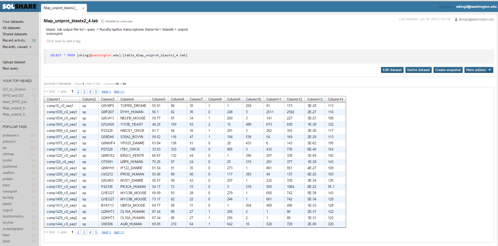
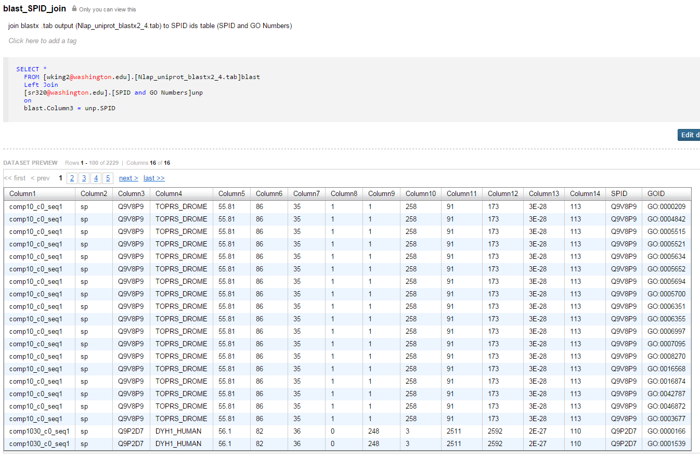
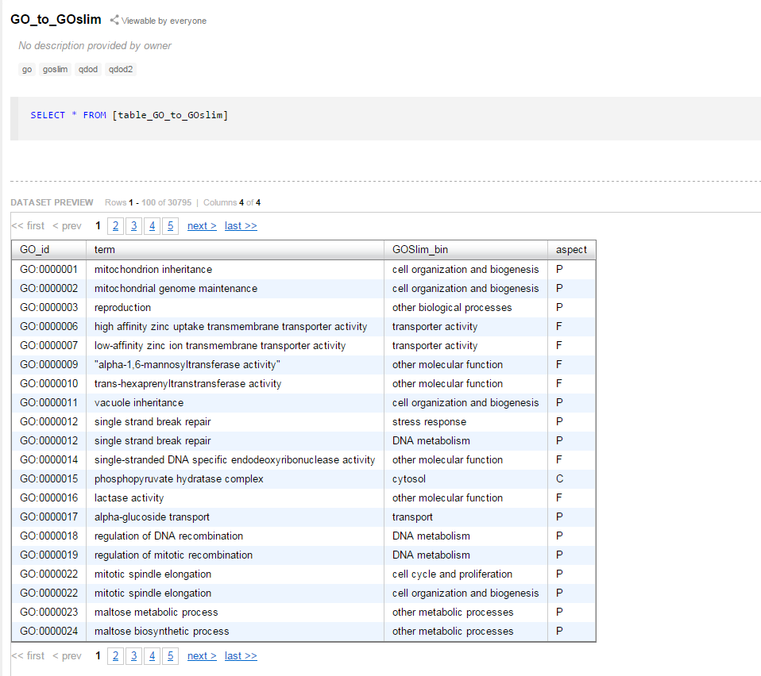
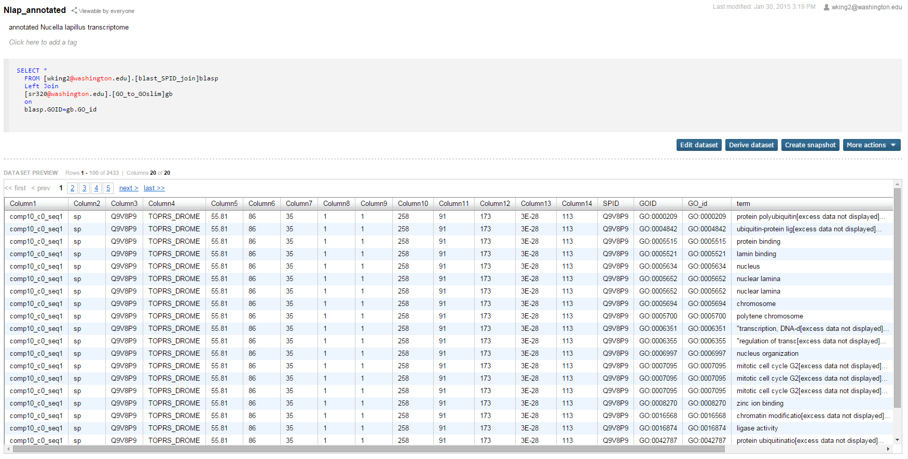
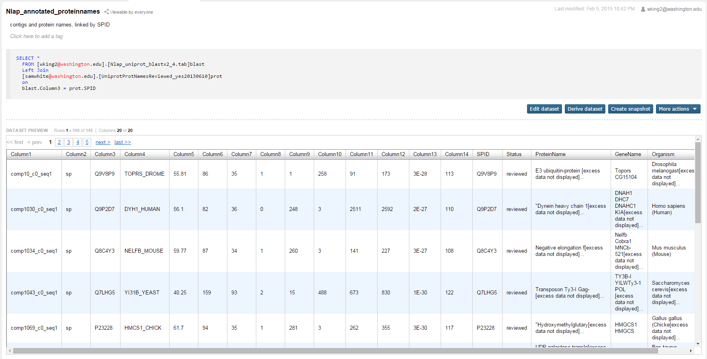
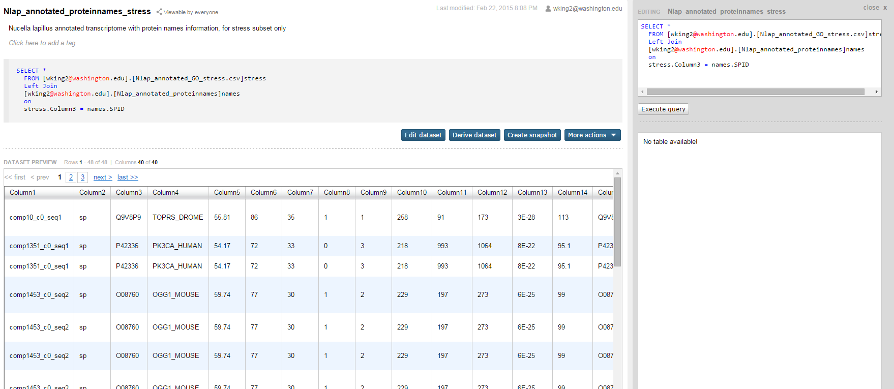
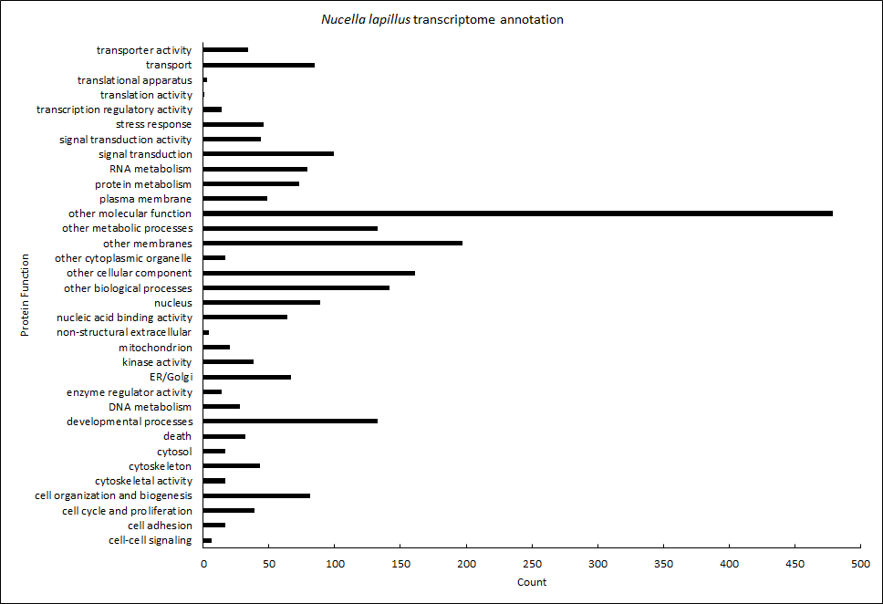
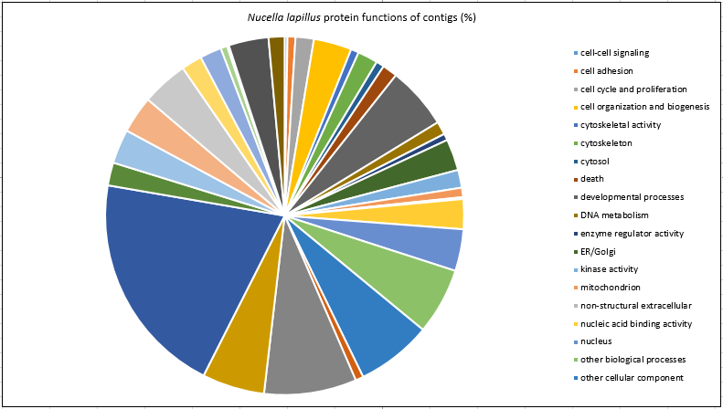

# Workflow

By following the steps in this workflow, you should be able to produce transcriptome annotation files for the dogwhelk, *Nucella lapillus* with Gene Ontology information and protein names information. You should also be able to produce stress subsets of the annotations. This workflow includes the steps for visualizing the annotations. A list of products produced in this workflow is available at the end of this document.

Software/tools used in this workflow:

- Windows 7 PC
- Roberts Lab Hummingbird (Mac OS v10.9.5)
- Bash (I used [Git Bash](https://msysgit.github.io/))
- Blast 2.2.29 (current version available on [NCBI](ftp://ftp.ncbi.nlm.nih.gov/blast/executables/blast+/LATEST/))
- SQLShare (in browswer, [link](https://sqlshare.escience.washington.edu/accounts/login/?next=/sqlshare/%3F__hash__%3D%2523s%253Dhome#s=home))
- Microsoft Excel 2013 for Windows
- GitHub GUI for windows ([link](https://windows.github.com/))

## Tunnel to Hummingbird

Using Bash on a Windows 7 PC, create a tunnel to Hummingbird (Mac OS v10.9.5).

	Owner@OWNER-PC ~
	$ ssh srlab@<insert_IPaddress_and_Port_here>
	Password:<insert_password_here>
	Last login: Mon Feb  2 20:20:50 2015 from c-71-227-172-56.hsd1.wa.comcast.net
	hummingbird:~ srlab$ pwd
	/Users/srlab
	hummingbird:~ srlab$
# 1) Blast

Note: Blast was already installed on Roberts Lab Hummingbird and configured so that I can run Blast commands from anywhere in the directory (as opposed to the usual case where I have to specify full file path to command, e.g. ../bin/blastx)

### Obtain *N. lapillus* transcriptome
Download (point and click) *N. lapillus* transcriptome (`.fa`, 50,698 KB) from [Dryad Digital Repository](http://dx.doi.org/10.5061/dryad.610dd) published in [Chu et al. (2014)](http://dx.doi.org/10.1111/mec.12681) onto Windows PC.

Rename transcriptome to `N.lapillus.fa`. Push transcriptome (`N.lapillus.fa`) to [GitHub repo](https://github.com/willking2/fish546_W15/tree/master/nlap-ano/data).

File here: [`N.lapillus.fa`](./data/N_lapillus.fa)

Clone the GitHub repo in Hummingbird (`/Users/srlab/fish546_W15/nlap-ano`) so that it can be accessed in Hummingbird. 

Someone cloned the repo for me in command line, so I don't have the exact code for it. Alternatively, you could just download the *N. lapillus* transcriptome directly on Hummingbird.

### Obtain Uniprot dataset
Download zipped Uniprot-SwissProt dataset (`.fasta.gz`, 260,395 KB) from [Uniprot website](http://www.uniprot.org/downloads) onto Roberts lab Hummingbird.

	hummingbird:willbigdata srlab$ curl -o uniprot_sprot.fasta.gz \
	ftp://ftp.uniprot.org/pub/databases/uniprot/current_release/knowledgebase/complete/uniprot_sprot.fasta.gz

Unzip the file
	
	hummingbird:willbigdata srlab$ gzip -d uniprot_sprot.fasta.gz
	hummingbird:willbigdata srlab$ ls
	uniprot_sprot.fasta

### Uniprot --> Blast db

Set Uniprot dataset as the database for `blastx`

	hummingbird:willbigdata srlab$ makeblastdb \
	 -in uniprot_sprot.fasta \
	 -dbtype \
	 -out uniprot_sprot_21JAN2015

	Building a new DB, current time: 01/21/2015 20:48:51
	New DB name:   uniprot_sprot_21JAN2015
	New DB title:  uniprot_sprot.fasta
	Sequence type: Protein
	Keep Linkouts: T
	Keep MBits: T
	Maximum file size: 1000000000B
	Adding sequences from FASTA; added 547357 sequences in 54.0656 seconds.

This creates the blast database, which appears as three separate files (`uniprot_sprot_21JAN2015.pin`, `uniprot_sprot_21JAN2015.phr`, and `uniprot_sprot_21JAN2015.psq`) recognized by `blast`.

### Run blastx

Notice the Evalue and outputformat as "6" (`.tab`)

	hummingbird:willbigdata srlab$ ls
	uniprot_sprot.fasta             uniprot_sprot_21JAN2015.pin
	uniprot_sprot_21JAN2015.phr     uniprot_sprot_21JAN2015.psq
	hummingbird:willbigdata srlab$ blastx \
	 -query /Users/srlab/fish546_W15/nlap-ano/data/N_lapillus.fa \
	 -db uniprot_sprot_21JAN2015 \
	 -out Nlap_uniprot_blastx.tab \
	 -evalue 1E-20 \
	 -max_target_seqs 1 \
	 -outfmt 6

Output file here: [`Nlap_uniprot_blastx.tab`](./data/Nlap_uniprot_blastx.tab)

# 2) Gene Ontology and Protein Info

Goal is to link `blastx` `.tab` output file to GO ids (GOID; [Gene Ontology](http://geneontology.org/) database that has functional annotations for protein sequences).

Take advantage of Roberts Lab tables on [SQLShare](https://sqlshare.escience.washington.edu/accounts/login/?next=/sqlshare/%3F__hash__%3D%2523s%253Dhome#s=home).

### Isolate SPID

The `blastx` `.tab` output file has the Swissprot ID (SPID) jammed in one column with other text (e.g. `sp|Q9V8P9|TOPRS_DROME`). To match it with another table, however, I need it in its own column. So, I isolate it by telling unix to change all the `|` to tabs, since it's a tab delimited file.

	cat Nlap_uniprot_blastx.tab | tr '|' '\t' > Nlap_uniprot_blastx2.tab

Now, the SPID can be in its own column! (e.g. `sp	Q9V8P9	TOPRS_DROME`) 

Output file here: [`Nlap_uniprot_blastx2.tab`](./data/Nlap_uniprot_blastx2.tab)

### Upload blastx output to SQLShare

I physically sat at Hummingbird desktop and got my `Nlap_uniprot_blastx.tab` file off of it using a USB, then put it onto my (Will's) PC. 

I then uploaded  (point and click) the file ([`Nlap_uniprot_blastx2.tab`](./data/Nlap_uniprot_blastx2.tab)) with isolated SPID (see previous step) as a database onto SQLShare (`Nlap_uniprot_blastx2_4.tab`).

	SELECT * FROM [wking2@washington.edu].[table_Nlap_uniprot)blastx2_4.tab]

### Join to GO id's

Using SQLShare, I joined my blastx output (`Nlap_uniprot_blastx2_4.tab`) to a [SQL table](https://sqlshare.escience.washington.edu/sqlshare/#s=query/sr320%40washington.edu/SPID%20and%20GO%20Numbers) (Roberts lab resource) that has both SPID and GOID. 

[screenshot](./img/Capture2.PNG)

The [resulting table](https://sqlshare.escience.washington.edu/sqlshare/#s=query/wking2%40washington.edu/blast_SPID_join) has blastx output data, SPID, and corresponding GOID.

	SELECT *
		FROM [wking2@washington.edu].[Nlap_uniprot_blastx2_4.tab]blast
		Left Join
		[sr320@washington.edu].[SPID and GO Numbers]unp
		on
		blast.Column3 = unp.SPID

### Join to GOSlim terms

Using SQLShare, I joined my [table](https://sqlshare.escience.washington.edu/sqlshare/#s=query/wking2%40washington.edu/blast_SPID_join) from the previous step to a [SQLtable](https://sqlshare.escience.washington.edu/sqlshare/#s=query/sr320%40washington.edu/GO_to_GOslim) (Roberts lab resource) that has both GOID and GOSlim terms. 

	SELECT *
		FROM [wking2@washington.edu].[blast_SPID_join]blasp
		Left Join
		[sr320@washington.edu].[Go_to_GOslim]gb
		on
		blasp.GOID=gb.GO_id

The resulting table is my [annotated *Nucella lapillus* transcriptome with contigs and GO info (Product 1)](https://sqlshare.escience.washington.edu/sqlshare/#s=query/wking2%40washington.edu/Nlap_annotated) that has blastx output data, SPID, GOID, and GOSlim terms.

Product 1: Annotated *N. lapillus* transcriptome -- contigs + GO info

File here: [`Nlap_annotated_GO.csv`](./products/Nlap_annotated_GO.csv)

### Join to Protein names

Using SQLShare, I joined my blastx output table (`Nlap_uniprot_blastx2_4.tab`)  to a [SQLtable](https://sqlshare.escience.washington.edu/sqlshare/#s=query/samwhite%40washington.edu/UniprotProtNamesReviewed_yes20130610) (Roberts lab resource) that has both SPID and Protein names. The resulting table is my [annotated *Nucella lapillus* transcriptome with contigs and protein names (Product 2)](https://sqlshare.escience.washington.edu/sqlshare/#s=query/wking2%40washington.edu/Nlap_annotated_proteinnames) that has blastx output data, SPID, and protein names.

	SELECT *
		FROM [wking2@washington.edu].[Nlap_uniprot_blastx2_4.tab]blast
		Left Join
		[samwhite@washington.edu].[UniprotProtNamesReviewed_yes20130610]prot
		on
		blast.Column3 = prot.SPID

Product 2: Annotated *N. lapillus* transcriptome -- contigs + protein names

File here: [`Nlap_annotated_proteinnames.csv`](./products/Nlap_annotated_proteinnames.csv)

### Subset stress related contigs

Since I am especially interested in stress response of marine organisms, I created subsets of my annotation datasets that are specific to stress related contigs.

I did this in command line, subsetting my [`Nlap_annotated_GO.csv`](./products/Nlap_annotated_GO.csv) file for rows that include the phrase "stress response" as a GOSlim term:

	$ awk -F"," '/[Ss]tress response/ {print $0}' Nlap_annotated_GO.csv > Nlap_anno
	tated_GO_stress.csv

Product 3: Annotated *N. lapillus* transcriptome -- contigs + GO info, stress related proteins only

File here: [`Nlap_annotated_GO_stress.csv`](./products/Nlap_annotated_GO_stress.csv)

I also made a subset of stress related contigs with protein names information. Since the annotated protein names file ([`Nlap_annotated_proteinnames.csv`](./products/Nlap_annotated_proteinnames.csv)) does not include GoSlim terms, I couldn't use `awk` to directly subset it. So, I uploaded [`Nlap_annotated_GO_stress.csv`](./products/Nlap_annotated_GO_stress.csv) onto SQLShare ([link](https://sqlshare.escience.washington.edu/sqlshare/#s=query/wking2%40washington.edu/Nlap_annotated_GO_stress.csv)) and used that to join with my protein names file ([link](https://sqlshare.escience.washington.edu/sqlshare/#s=query/wking2%40washington.edu/Nlap_annotated_proteinnames)), matching by their shared SPIDs.

	SELECT *
		FROM [wking2@washington.edu].[Nlap_annotated_GO_stress.csv]stress
		Left Join
		[wking2@washington.edu].[Nlap_annotated_proteinnames]]names
		on
		stress.Column3 = names.SPID

Product 4: Annotated *N. lapillus* transcriptome -- contigs + protein names, stress related proteins only

File here: [`Nlap_annotated_proteinnames_stress.csv`](./products/Nlap_annotated_proteinnames_stress.csv)

# 3) Visualization

### Bar graph of protein functions

Open [`Nlap_annotated_GO.csv`](./data/Nlap_annotated_GO.csv) in Excel.

Make a separate three column table. First column is "`categories`" and has all of the unique GoSlim categories (bins):

	cell-cell signaling						cell adhesion
	cell cycle and proliferation			cell organization and biogenesis
	cytoskeletal activity					cytoskeleton
	cytosol									death
	developmental processes					DNA metabolism
	enzyme regulator activity				ER/Golgi
	kinase activity							mitochondrion
	non-structural extracellular			nucleic acid binding activity
	nucleus									other biological processes
	other cellular component				other cytoplasmic organelle
	other membranes							other metabolic processes
	other molecular function				plasma membrane
	protein metabolism						RNA metabolism
	signal transduction						signal transduction activity
	stress response							transcription regulatory activity
	translation activity					translational apparatus
	transport								transporter activity

Second column is the counts of each category in  of [`Nlap_annotated_GO.csv`](./data/Nlap_annotated_GO.csv). Do this using `COUNTIF` Excel function where the `range` is the "`GOSlim_bin`" column and the `criteria` is "`categories`" column. 

Also calculate count total (should equal number of rows in "`GOSlim_bin`"). Call this cell `total`. 

Third column (`"%"`) is the percentage of each bin, calculated as `(count/total)*100`.

The first few rows of the table should look like this:

	categories						count	%
	cell-cell signaling				6		0.253699789
	cell adhesion					17		0.718816068
	cell cycle and proliferation	39		1.649048626

Using the `Insert Chart` Excel function, plot a bar graph of the table with categories on the y-axis and counts on the x-axis. 

Change appearance to taste. 

Product 5: Count Bar Graph of protein functions for *N. lapillus* contigs

Excel file here: [`Nlap_GO_plot.xlsx`](./analyses/Nlap_GO_plot.xlsx)

### Pie chart of protein functions

Using the table of category counts generated for the bar graph above, use the `Insert Chart` Excel function again, this time choosing Pie Chart. 

Change appearance to taste. 

Product 6: Frequency Pie Chart of protein functions for *N. lapillus* contigs

Excel file here: [`Nlap_GO_plot.xlsx`](./analyses/Nlap_GO_plot.xlsx)

----------

# List of Products
1) [`Nlap_annotated_GO.csv`](./products/Nlap_annotated_GO.csv) -- contigs and GO info

2) [`Nlap_annotated_proteinnames.csv`](./products/Nlap_annotated_proteinnames.csv) -- contigs and protein names

3) [`Nlap_annotated_GO_stress.csv`](./products/Nlap_annotated_GO_stress.csv) -- contigs and GO info, stress related only

4) [`Nlap_annotated_proteinnames_stress.csv`](./products/Nlap_annotated_proteinnames_stress.csv) -- contigs and protein names, stress related only

5) [`Nlap_GOSlim_count.png`](./products/Nlap_GOSlim_count.png) -- graph of counts of protein frequencies

6) [`Nlap_GOSlim_percent.png`](./products/Nlap_GOSlim_percent.png) -- graph of percentages of protein frequencies
