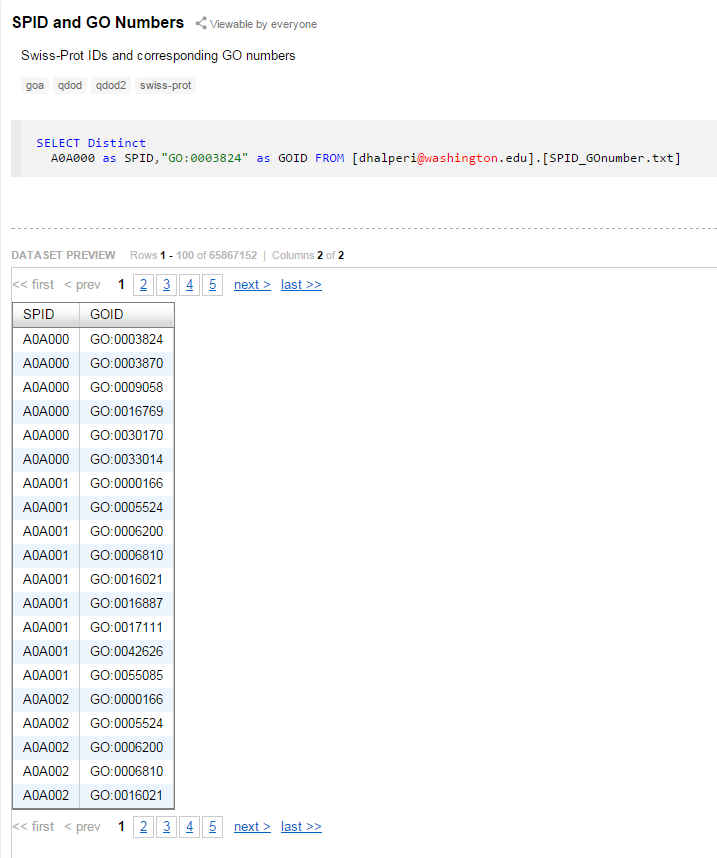

# Workflow

**TO DO**: "By following the steps in this notebook, you should be able to...."
"the software/tools that you will need to reproduce these steps are: -Bash, blast,sqlshare, microsoft excel; you can get these programs at..."

Note: this workflow presents my actual steps, which were not necessarily the most efficient.

Summary list of products at end of workflow.

## Tunnel to Hummingbird
On Will's PC (PC Windows 7), open unix shell (GitBash)

	Owner@OWNER-PC ~
	$ ssh srlab@<insert_IPaddress_and_Port_here>
	Password:<insert_password_here>
	Last login: Mon Feb  2 20:20:50 2015 from c-71-227-172-56.hsd1.wa.comcast.net
	hummingbird:~ srlab$ pwd
	/Users/srlab
	hummingbird:~ srlab$

This creates a tunnel to Hummingbird (Mac OS v10.9.5).

## Obtain Datasets
### Obtain *N. lapillus* transcriptome
Download (point and click) *N. lapillus* transcriptome (`.fa`) from [Dryad Digital Repository](http://dx.doi.org/10.5061/dryad.610dd) published in [Chu et al. (2014)](http://dx.doi.org/10.1111/mec.12681) onto Will's PC.

Rename transcriptome to `N.lapillus.fa`.

Push transcriptome (`N.lapillus.fa`) to [GitHub repo](https://github.com/willking2/fish546_W15/tree/master/nlap-ano/data).

File here: [`N.lapillus.fa`](./data/N_lapillus.fa)

### Obtain Uniprot dataset
Download zipped Uniprot-SwissProt dataset (`.fasta.gz`) from [Uniprot website](http://www.uniprot.org/downloads) onto Roberts lab Hummingbird.

	hummingbird:willbigdata srlab$ pwd 
	/Users/srlab/willbigdata
	hummingbird:willbigdata srlab$ curl -o uniprot_sprot.fasta.gz ftp://ftp.uniprot.org/pub/databases/uniprot/current_release/knowledgebase/complete/uniprot_sprot.fasta.gz

Unzip the file
	
	hummingbird:willbigdata srlab$ pwd 
	/Users/srlab/willbigdata
	hummingbird:willbigdata srlab$ ls
	uniprot_sprot.fasta.gz
	hummingbird:willbigdata srlab$ gzip -d uniprot_sprot.fasta.gz
	hummingbird:willbigdata srlab$ ls
	uniprot_sprot.fasta

#Blast

Note: I used **Blast 2.2.29**. This was already installed on Roberts Lab Hummingbird and configured so that I can run Blast commands from anywhere in the directory (as opposed to the usual case where I have to specify full file path to command, e.g. ../bin/blastx)

### Uniprot --> Blast db

Set Uniprot dataset as the database for `blastx`

	hummingbird:willbigdata srlab$ pwd
	/Users/srlab/willbigdata
	hummingbird:willbigdata srlab$ ls
	uniprot_sprot.fasta
	hummingbird:willbigdata srlab$ makeblastdb -in uniprot_sprot.fasta -dbtype -out uniprot_sprot_21JAN2015
	Building a new DB, current time: 01/21/2015 20:48:51
	New DB name:   uniprot_sprot_21JAN2015
	New DB title:  uniprot_sprot.fasta
	Sequence type: Protein
	Keep Linkouts: T
	Keep MBits: T
	Maximum file size: 1000000000B
	Adding sequences from FASTA; added 547357 sequences in 54.0656 seconds.

This creates the blast database, which appears as three separate files (`uniprot_sprot_21JAN2015.pin`, `uniprot_sprot_21JAN2015.phr`, and `uniprot_sprot_21JAN2015.psq`) recognized by `blast`.

### Run blastx

Notice the Evalue and outputformat as "6" (`.tab`)

	hummingbird:willbigdata srlab$ pwd
	/Users/srlab/willbigdata
	hummingbird:willbigdata srlab$ ls
	uniprot_sprot.fasta             uniprot_sprot_21JAN2015.pin
	uniprot_sprot_21JAN2015.phr     uniprot_sprot_21JAN2015.psq
	hummingbird:willbigdata srlab$ blastx -query /Users/srlab/fish546_W15/nlap-ano/
	data/N_lapillus.fa -db uniprot_sprot_21JAN2015 -out Nlap_uniprot_blastx.tab -evalue 1E-20 -max_target_seqs 1 -outfmt 6

Output file here: [`Nlap_uniprot_blastx.tab`](./data/Nlap_uniprot_blastx.tab)

#Concatenate

Goal is to link `blastx` `.tab` output file to GO ids (GOID; [Gene Ontology](http://geneontology.org/) database that has functional annotations for protein sequences).

Take advantage of Roberts Lab tables on [SQLShare](https://sqlshare.escience.washington.edu/accounts/login/?next=/sqlshare/%3F__hash__%3D%2523s%253Dhome#s=home).

### Isolate SPID

The `blastx` `.tab` output file has the Swissprot ID (SPID) jammed in one column with other text (e.g. `sp|Q9V8P9|TOPRS_DROME`). To match it with another table, however, I need it in its own column. So, I isolate it by telling unix to change all the `|` to tabs, since it's a tab delimited file.

	cat Nlap_uniprot_blastx.tab | tr '|' '\t' > Nlap_uniprot_blastx2.tab

Now, the SPID can be in its own column! (e.g. `sp	Q9V8P9	TOPRS_DROME`) 

Output file here: [`Nlap_uniprot_blastx2.tab`](./data/Nlap_uniprot_blastx2.tab)

### Upload blastx output to SQLShare

I physically sat at Hummingbird desktop and got my `Nlap_uniprot_blastx.tab` file off of it using a USB, then put it onto my (Will's) PC. I then uploaded  (point and click) the file ([`Nlap_uniprot_blastx2.tab`](./data/Nlap_uniprot_blastx2.tab)) with isolated SPID (see previous step) as a database onto SQLShare (`Nlap_uniprot_blastx2_4.tab`... it's `2_4` because I had to go through a few trial and error attempts).

### Join to GO id's

Using SQLShare, I joined my blastx output (`Nlap_uniprot_blastx2_4.tab`) to a [SQL table](https://sqlshare.escience.washington.edu/sqlshare/#s=query/sr320%40washington.edu/SPID%20and%20GO%20Numbers) (Roberts lab resource) that has both SPID and GOID. The [resulting table](https://sqlshare.escience.washington.edu/sqlshare/#s=query/wking2%40washington.edu/blast_SPID_join) has blastx output data, SPID, and corresponding GOID.

### Join to GOSlim terms

Using SQLShare, I joined my [table](https://sqlshare.escience.washington.edu/sqlshare/#s=query/wking2%40washington.edu/blast_SPID_join) from the previous step to a [SQLtable](https://sqlshare.escience.washington.edu/sqlshare/#s=query/sr320%40washington.edu/GO_to_GOslim) (Roberts lab resource) that has both GOID and GOSlim terms. The resulting table is my [annotated *Nucella lapillus* transcriptome with contigs and GO info (Product 1)](https://sqlshare.escience.washington.edu/sqlshare/#s=query/wking2%40washington.edu/Nlap_annotated) that has blastx output data, SPID, GOID, and GOSlim terms.

Product 1: Annotated *N. lapillus* transcriptome -- contigs + GO info

File here: [`Nlap_annotated_GO.csv`](./products/Nlap_annotated_GO.csv)

### Join to Protein names

Using SQLShare, I joined my blastx output table (`Nlap_uniprot_blastx2_4.tab`)  to a [SQLtable](https://sqlshare.escience.washington.edu/sqlshare/#s=query/samwhite%40washington.edu/UniprotProtNamesReviewed_yes20130610) (Roberts lab resource) that has both SPID and Protein names. The resulting table is my [annotated *Nucella lapillus* transcriptome with contigs and protein names (Product 2)](https://sqlshare.escience.washington.edu/sqlshare/#s=query/wking2%40washington.edu/Nlap_annotated_proteinnames) that has blastx output data, SPID, and protein names.

Product 2: Annotated *N. lapillus* transcriptome -- contigs + protein names

File here: [`Nlap_annotated_proteinnames.csv`](./products/Nlap_annotated_proteinnames.csv)

### Subset stress related contigs

Since I am especially interested in stress response of marine organisms, I created subsets of my annotation datasets that are specific to stress related contigs.

I did this in command line, subsetting my [`Nlap_annotated_GO.csv`](./products/Nlap_annotated_GO.csv) file for rows that include the phrase "stress response" as a GOSlim term:

	$ awk -F"," '/[Ss]tress response/ {print $0}' Nlap_annotated_GO.csv > Nlap_anno
	tated_GO_stress.csv

Product 3: Annotated *N. lapillus* transcriptome -- contigs + GO info, stress related proteins only

File here: [`Nlap_annotated_GO_stress.csv`](./products/Nlap_annotated_GO_stress.csv)

I also made a subset of stress related contigs with protein names information. Since the annotated protein names file ([`Nlap_annotated_proteinnames.csv`](./products/Nlap_annotated_proteinnames.csv)) does not include GoSlim terms, I couldn't use `awk` to directly subset it. So, I uploaded [`Nlap_annotated_GO_stress.csv`](./products/Nlap_annotated_GO_stress.csv) onto SQLShare ([link](https://sqlshare.escience.washington.edu/sqlshare/#s=query/wking2%40washington.edu/Nlap_annotated_GO_stress.csv)) and used that to join with my protein names file ([link](https://sqlshare.escience.washington.edu/sqlshare/#s=query/wking2%40washington.edu/Nlap_annotated_proteinnames)), matching by their shared SPIDs:

Product 4: Annotated *N. lapillus* transcriptome -- contigs + protein names, stress related proteins only

File here: [`Nlap_annotated_proteinnames_stress.csv`](./products/Nlap_annotated_proteinnames_stress.csv)

# Visualize results

### Bar graph of protein functions

After fiddling unsuccessfully with R, I decided to graph with Excel-- just took some elbow grease, is all. Count the number of occurrences of each GoSlim_bin using Excel's `COUNTIF` function, throw it on a column graph, and presto:

Product 5: Count Bar Graph of protein functions for *N. lapillus* contigs

Excel file here: [`Nlap_GO_plot.xlsx`](./analyses/Nlap_GO_plot.xlsx)

### Pie chart of protein functions

Again in Excel, I plotted the percentages of contigs by protein function.

Product 6: Frequency Pie Chart of protein functions for *N. lapillus* contigs

Excel file here: [`Nlap_GO_plot.xlsx`](./analyses/Nlap_GO_plot.xlsx)

----------

# List of Products
1) [`Nlap_annotated_GO.csv`](./data/Nlap_annotated_GO.csv) -- contigs and GO info

2) [`Nlap_annotated_proteinnames.csv`](./data/Nlap_annotated_proteinnames.csv) -- contigs and protein names

3) [`Nlap_annotated_GO_stress.csv`](./products/Nlap_annotated_GO_stress.csv) -- contigs and GO info, stress related only

4) [`Nlap_annotated_proteinnames_stress.csv`](./products/Nlap_annotated_proteinnames_stress.csv) -- contigs and protein names, stress related only

5) [`Nlap_GO_plot.xlsx`](./analyses/Nlap_GO_plot.xlsx) -- graph of counts of protein frequencies

6) [`Nlap_GO_plot.xlsx`](./analyses/Nlap_GO_plot.xlsx) -- graph of percentages of protein frequencies
